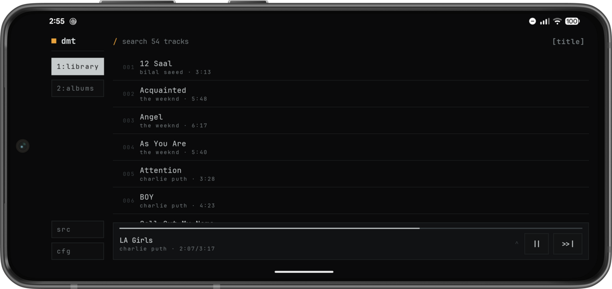
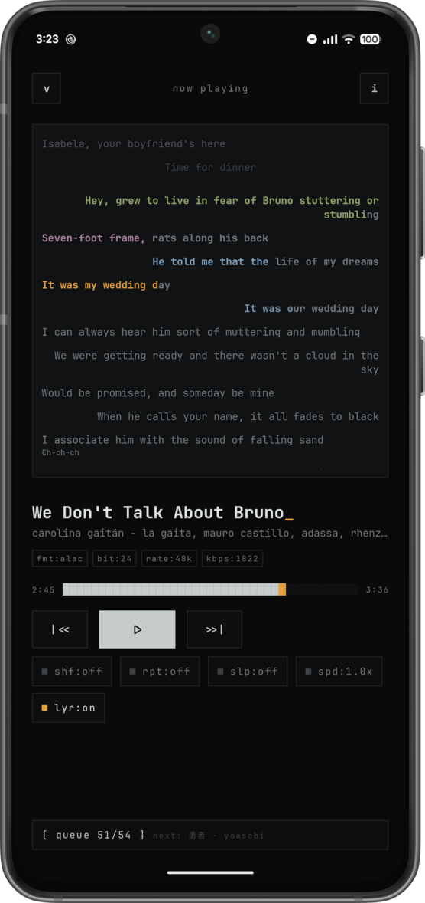
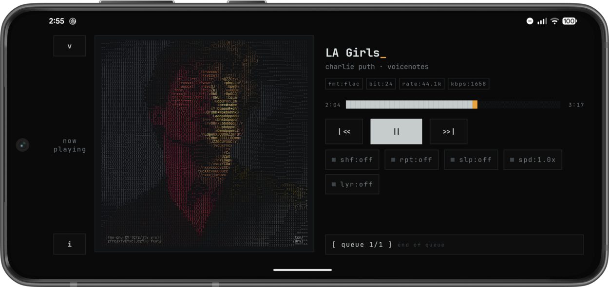

# dmt

dear music, thanks.

a tui-inspired music player for android. music helped me through a lot,
this is the thank you note.

## for short attention spans

- terminal look, amber on black, cover art as ascii
- plays local files, or your own jellyfin
- ffmpeg decoders bundled, dolby ac-4 included
- synced lyrics, karaoke view, ttml and lrc
- no ads, no analytics, nothing to sign up for (jellyfin uses your own server
  account)

## screenshots

<table>
  <tr>
    <td width="68%">
      
    </td>
    <td width="32%" rowspan="2">
      
    </td>
  </tr>
  <tr>
    <td>
      
    </td>
  </tr>
</table>

## library

- tabs for tracks, albums, artists, folders, playlists
- every list says how many and how long
- artists come from the album artist tag, so a feature does not split the
  artist or turn the album into "various artists"
- one search across tracks, albums and artists
- make playlists, add or remove tracks, delete them
- sort by title, artist, recently added or recently modified
- folder blocklist keeps voice notes out
- home shelves for most played, plus a row of stuff you never played

## playback

- full screen player, real landscape layout, mini player everywhere else
- queue and track info in sheets, remove items one by one
- sleep timer 15/30/60, speed 0.75x to 2x, shuffle, repeat
- resumes last queue, track and position on launch
- keeps playing when you swipe the app away, unless you tell it not to
- undecodable track says so on the player instead of running silent

## formats

- bundled ffmpeg decoders for what android will not touch
- dolby ac-4 works: mainline ffmpeg has no decoder and android only ships one
  on licensed devices, so this uses paul b mahol's decoder from librempeg,
  built by [dmt-decoder-ffmpeg](https://github.com/imjyotiraditya/dmt-decoder-ffmpeg)
- codec, bitrate, sample rate, bit depth, size, down to he-aac and vbr
- chain tab shows the output route: audio api, buffer, flags, device
- cue sheets split one big rip into real tracks, with per track titles,
  artists and lengths (needs all files access)

## lyrics

- from file tags (mp3, flac, m4a, ogg) or .lrc / .ttml next to the song
- ttml does word timing, background vocals, duet sides, multiple singers
- karaoke view in the player
- translation, transliteration, original or romanized
- lyr? pulls from lrclib on demand, never automatically, and can write what
  it finds back into the file

## look

- ascii cover art with a light sweep while playing
- no art? generated ascii pattern instead, or turn ascii off entirely
- amber on black, ibm plex mono, boxed keys, no rounded anything

## elsewhere

- android auto: tracks and albums, voice search, shuffle and repeat
- listening stats: time listened, play counts, most played with bars
- system equalizer, media notification with art
- external media widgets (kustom and friends) can read what is playing

## sources

- local files or a self-hosted jellyfin, tap to switch
- log in once, it keeps the server and token, never the password
- covers, lyrics and format info come from the server too

## building

- open in android studio, hit run, minSdk 30
- release apk lands around 12mb, most of it ffmpeg
- ci builds a signed release on every push to main, and cuts a github release
  on a tag

## stack

kotlin, compose, media3, datastore, ibm plex mono. single state + actions,
no magic. tag reading and lyrics parsing are own modules, no jaudiotagger.
ffmpeg and media3 come from
[dmt-ffmpeg](https://github.com/imjyotiraditya/dmt-ffmpeg) and
[dmt-media3](https://github.com/imjyotiraditya/dmt-media3).

the network only ever talks to your own jellyfin, and to lrclib when you ask
for missing lyrics. it just plays music.
